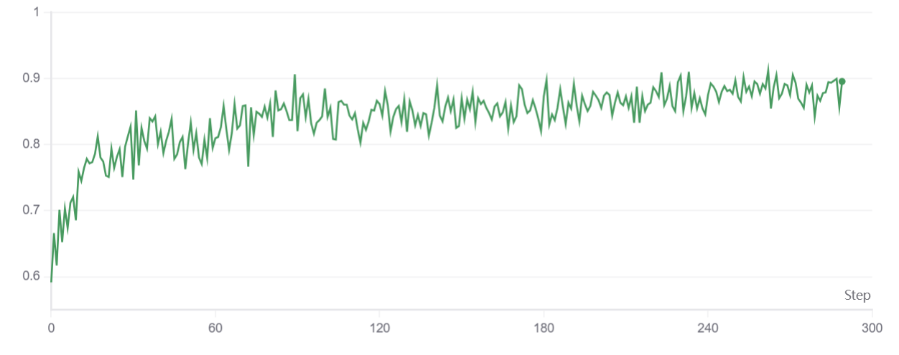

# On-Policy Distillation

## Overview

On-policy distillation trains the student using teacher guidance on trajectories sampled
from its own policy, reducing distribution mismatch and improving stability. Combined
with reinforcement learning, it lets the student **imitate the teacher while exploring
simultaneously**.

**AReaL** previously supported RL for post-training. With this implementation, it now
also supports **on-policy knowledge distillation** and the **combined KDRL framework**,
enabling the student to learn from a teacher while exploring via RL on the same
on-policy trajectories, improving both efficiency and stability.

## The Core Concept

Knowledge distillation aims to train the student policy $\pi_\theta$ to mimic the
behavior of a more powerful teacher $\pi_T$. The choice of divergence measure and
sampling distribution significantly impacts the student's final performance and exposure
bias.

### Supervised Fine-Tuning (Forward KL):

A simple yet effective method is to maximize the log-likelihood on data generated by the
teacher, known as supervised fine-tuning (SFT). This is equivalent to minimizing the
Forward KL divergence between $\pi_T$ and $\pi_\theta$:

$$\arg \min_{\theta}
D_{KL}(\pi_T \parallel \pi_\theta) = \arg \max_{\theta} \mathbb{E}_{q \sim
Q, o \sim \pi_T(\cdot|q)} [\log \pi_\theta(o|q)]$$

### On-Policy Distillation (Reverse KL):

While SFT is efficient, training on off-policy data induces exposure bias: a mismatch
between training on teacher-generated prefixes and inference on self-generated prefixes.
This is especially severe for reasoning LLMs with long response chains. To alleviate
this, we can train on self-generated trajectories, which is equivalent to minimizing the
Reverse KL divergence (RKL) [1]:

$$\arg \min_{\theta} D_{KL}(\pi_\theta
\parallel \pi_T) = \arg \max_{\theta} \mathbb{E}_{q \sim Q, o \sim
\pi_\theta(\cdot|q)} \left[ \log \frac{\pi_T(o|q)}{\pi_\theta(o|q)}
\right]$$

Minimizing RKL is equivalent to REINFORCE where the "reward" is the log-ratio of teacher
to student probabilities. By adopting the GRPO framework, we optimize [1]:

$$J_{RKL}(\theta) = \mathbb{E}_{q, {o_i} \sim \pi_{\theta_{old}}} \left[
\frac{1}{G} \sum_{i=1}^G \frac{1}{|o_i|} \sum_{t=1}^{|o_i|}
\frac{\pi_\theta(o_{i,t})}{\pi_{\theta_{old}}(o_{i,t})} R_{i,t} \right]$$

where the reward $R_{i,t} = \log \pi_T(o_{i,t}) - \log \pi_\theta(o_{i,t})$.
This encourages the student to increase the probability of tokens the teacher prefers
and suppress those it deems unlikely.

#### Implementation Detail
During pure KD, we need to set `rl_loss_weight` to 0, so the
implementation estimates the RKL gradient using importance sampling. The code
calculates the reward as teacher_logp - logprobs ($R_{i,t}$) and applies a negative
coefficient to the loss to perform minimization (check `areal/trainer/ppo/actor.py`).

### Why Reverse KL Enables On-Policy Distillation

Forward KL requires samples from the teacher distribution:

$$
D_{KL}(\pi_T \parallel \pi_\theta)
=
\mathbb{E}_{o \sim \pi_T}
\left[
\log \pi_T(o)
-
\log \pi_\theta(o)
\right].
$$

In contrast, Reverse KL is evaluated over samples drawn from the student policy:

$$
D_{KL}(\pi_\theta \parallel \pi_T)
=
\mathbb{E}_{o \sim \pi_\theta}
\left[
\log \pi_\theta(o)
-
\log \pi_T(o)
\right].
$$

This allows the student to generate trajectories using its current policy and then
evaluate them with the teacher. Consequently, training and inference operate on the
same distribution of prefixes, significantly reducing exposure bias.

### Combination of GRPO and KD

We implemented KD+RL approach using a Joint Loss strategy.

#### Joint Loss:

This strategy augments the GRPO objective with an auxiliary KL loss term. To maintain
consistency with the on-policy nature of GRPO, it utilizes the Reverse KL (RKL) [1]:
$$J_{KDRL}(\theta) = J_{GRPO}(\theta) - \beta D_{KL}(\pi_\theta \parallel
\pi_T) \tag{8}$$

The gradient $\nabla_\theta J_{KDRL}(\theta)$ provides an unbiased estimate of
$\nabla_\theta J_{GRPO}( \theta) + \beta \cdot \nabla_\theta
J_{RKL}(\theta)$.

#### Implementation Detail
In the joint loss case (`rl_loss_weight` > 0), the RKL is
treated as a direct penalty. Minimizing the term `logprobs - teacher_logp` is
mathematically equivalent to minimizing the Reverse KL objective
$D_{KL}(\pi_\theta \parallel \pi_T)$ when sampling from the student distribution
$\pi_\theta$. In the code, this is implemented as:
`loss = rl_loss_weight * loss + distill_loss_weight * rkl_penalty`

### Multi-Teacher Distillation

AReaL supports distillation from multiple teachers simultaneously. Let
\(\{\pi_{T_k}\}_{k=1}^{K}\) denote a set of teacher policies with mixture weights
\(\{w_k\}_{k=1}^{K}\), where \(w_k \ge 0\) and \(\sum_k w_k = 1\).

Instead of distilling from a single teacher, AReaL constructs a mixture teacher:

$$
\pi_{mix}(o|q)
=
\sum_{k=1}^{K}
w_k \pi_{T_k}(o|q)
$$

and uses \(\pi_{mix}\) as the teacher distribution in all KD and KDRL objectives.

For numerical stability, the mixture is computed directly in log-space:

$$
\log \pi_{mix}(o|q)
=
\log
\left(
\sum_{k=1}^{K}
w_k \pi_{T_k}(o|q)
\right)
=
\operatorname{logsumexp}
\left(
\log w_k + \log \pi_{T_k}(o|q)
\right)
$$

This produces a valid teacher distribution that combines the preferences of all
teachers while preserving uncertainty when teachers disagree.

#### Why Use Multiple Teachers?

Multi-teacher distillation allows the student to benefit from complementary strengths of
different models.

Examples include:

- A stronger reasoning model and a stronger instruction-following model.
- Teachers specialized in different domains (math, coding, science, etc.).
- Multiple checkpoints representing different training stages.

The student is trained against the aggregated teacher distribution rather than any
individual teacher, resulting in a smoother and often more stable training signal.

#### Implementation Detail

For each sampled trajectory:

1. Every teacher computes token-level log-probabilities.
2. The weighted mixture distribution is constructed using log-sum-exp.
3. The resulting `teacher_logp` is stored in the trajectory.
4. KD or KDRL proceeds exactly as in the single-teacher case.

No changes to the optimization objective are required.


## Running the example

Need to add teacher configuration to your yaml.

Each entry in `teacher.teachers` supports two modes via `engine_type`:

- `rollout` (recommended): inference-only teacher (vLLM/SGLang) with lower memory
  overhead.
- `train` (legacy, deprecated): train-engine teacher path kept for backward
  compatibility.

AReaL also supports **multi-teacher weighted mixture** distillation with `teacher.teachers`.

### Mode 1: rollout teacher (recommended)


```yaml
teacher:
  teachers:
    - engine_type: rollout
      path: Qwen/Qwen2.5-14B-Instruct
      weight: 1.0
      rollout:
        backend: "vllm:d1p1t2" # or sglang:d...
        scheduling_spec:
          - task_type: worker
            port_count: 2
            gpu: 1
            mem: 32
            cmd: python3 -m areal.infra.rpc.rpc_server
            env_vars: {}
  rl_loss_weight: 1.0
  distill_loss_weight: 5e-3
```

Example command using local scheduler:

```bash
python3 examples/math/gsm8k_rl.py \
  --config examples/distillation/gsm8k_grpo_distill_mode_rolloutEngine.yaml \
  scheduler.type=local \
  experiment_name=gsm8k-grpo-distillation \
  trial_name=trial0
```

### Mode 2: legacy train teacher (deprecated)

```yaml
teacher:
  teachers:
    - engine_type: train
      weight: 1.0
      train:
        backend: fsdp:d1p1t4
        experiment_name: ${experiment_name}
        trial_name: ${trial_name}
        path: Qwen/Qwen2.5-14B-Instruct
        init_from_scratch: false
        disable_dropout: true
        dtype: ${actor.dtype}
        mb_spec:
          max_tokens_per_mb: 10240
        optimizer: null
        scheduling_spec: ${actor.scheduling_spec}
  rl_loss_weight: 1.0
  distill_loss_weight: 0.005
```

### Mode 3: multi-teacher weighted mixture (rollout)

```yaml
teacher:
  teachers:
    - engine_type: rollout
      path: Qwen/Qwen2.5-14B-Instruct
      weight: 0.7
      rollout:
        backend: "vllm:d1p1t2"
        scheduling_spec:
          - task_type: worker
            port_count: 2
            gpu: 1
            mem: 32
            cmd: python3 -m areal.infra.rpc.rpc_server
            env_vars: {}
    - engine_type: rollout
      path: Qwen/Qwen2.5-7B-Instruct
      weight: 0.3
      rollout:
        backend: "vllm:d1p1t1"
        scheduling_spec:
          - task_type: worker
            port_count: 2
            gpu: 1
            mem: 32
            cmd: python3 -m areal.infra.rpc.rpc_server
            env_vars: {}
  rl_loss_weight: 1.0
  distill_loss_weight: 0.005
```

At training time, token-level mixture teacher log-probability is computed as:
`log p_mix = logsumexp(log normalized_weight_i + log p_i)`.
The KD/KDRL objective is then unchanged and consumes this mixed `teacher_logp`.


Example command using local scheduler:

```bash
python3 examples/math/gsm8k_rl.py \
  --config examples/distillation/gsm8k_grpo_distill_mode_trainEngine.yaml \
  scheduler.type=local \
  experiment_name=gsm8k-grpo-distillation \
  trial_name=trial0
```

## Result

On-policy knowledge distillation + RL reward plot for Qwen2.5-14B-Instruct (teacher) and
Qwen3-0.6B (student), trained using FSDP and vLLM.



## References

[1] Xu H, Zhu Q, Deng H, Li J, Hou L, Wang Y, Shang L, Xu R, Mi F. Kdrl: Post-training
reasoning llms via unified knowledge distillation and reinforcement learning.
[KDRL paper link](https://arxiv.org/pdf/2506.02208)
