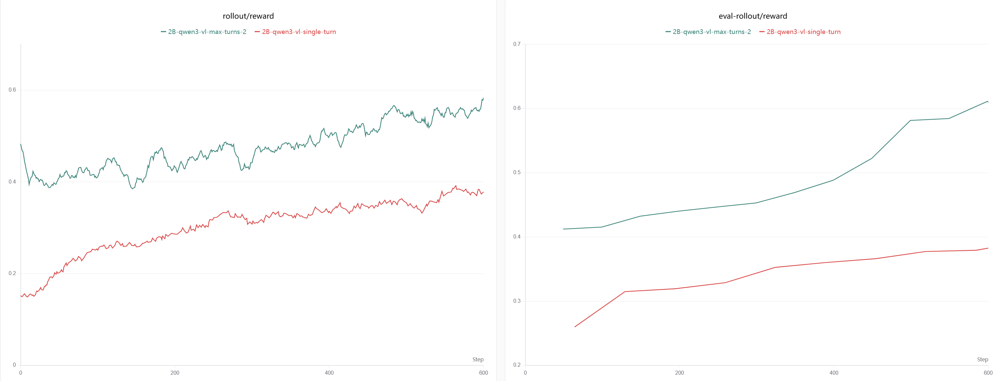
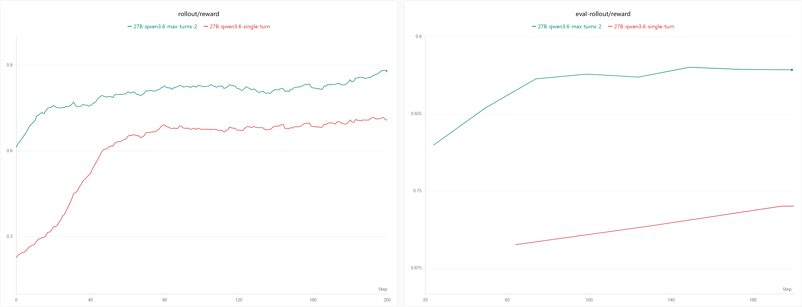

# Multi-Turn Tool-Calling VLM GRPO (geometry3k)

Train a Vision-Language Model on geometry3k with a multi-turn **`calc_score` tool
loop**.

## Design

The image is fixed; the model reasons inside `<think>...</think>` and submits its answer
by emitting a `calc_score` tool call as text. Two formats are supported (set by
`tool_format`):

```text
hermes       <tool_call>{"name": "calc_score", "arguments": {"answer": "<value>"}}</tool_call>
qwen3_coder  <tool_call><function=calc_score><parameter=answer><value></parameter></function></tool_call>
```

The environment (`Geo3kCalcScoreEnv`) parses the tool call, grades the answer with
`mathruler.grade_answer`, and returns text feedback. `calc_score` is the only way to
answer: a wrong answer or a missing tool call is fed back and the model retries — up to
`max_turns`; on the final turn a `\boxed{...}` answer is also accepted at partial
credit. The episode ends when the answer is correct or `max_turns` is reached; reward is
the best (discounted) grade across turns (`turn_discount` 1.0 = flat terminal).

The design splits responsibilities: a **general, task-agnostic workflow** drives the
loop and owns the VLM trajectory mechanics, while a **task env** owns the tool, grading,
feedback, and termination.

- `MultiTurnVisionEnv` ABC —
  [areal/workflow/vision_env.py](../../areal/workflow/vision_env.py) (`reset`/`step`,
  `EnvResetResult`/`EnvStepResult`)
- `VisionMultiTurnWorkflow` —
  [areal/workflow/vision_multiturn.py](../../areal/workflow/vision_multiturn.py)
  (env-driven)
- `Geo3kCalcScoreEnv` — [geo3k_env.py](geo3k_env.py) (the `calc_score` tool)

## Files

- `geometry3k_grpo_mt.py` — training script (wires `env_factory`/`env_args`).
- `geo3k_env.py` — the `Geo3kCalcScoreEnv` (tool schema + grading + feedback).
- `qwen3_vl_2b_geometry3k_grpo_mt.yaml` — Qwen3-VL-2B-Instruct (non-thinking): `hermes`
  \+ `concat`, one Ascend NPU node.
- `qwen3_6_27b_geometry3k_grpo_mt.yaml` — Qwen3.6-27B (thinking, GDN): `qwen3_coder` +
  `individual`, two nodes via Ray.
- `config.py` — `MultiTurnVLMGRPOConfig` (`max_turns`, `turn_discount`, `export_style`,
  `tool_format`).
- `run_geometry3k_grpo_mt_npu.sh` — NPU launch script.

## Multi-turn parameters

| Parameter       | Default  | Description                                                                                                         |
| --------------- | -------- | ------------------------------------------------------------------------------------------------------------------- |
| `max_turns`     | 2        | Maximum tool-calling turns per episode.                                                                             |
| `turn_discount` | 1.0      | Per-turn reward discount; 1.0 = flat terminal reward.                                                               |
| `export_style`  | `concat` | `concat` (one trajectory/episode; non-thinking) or `individual` (one sample/turn; thinking models strip `<think>`). |
| `tool_format`   | `hermes` | `hermes` (Qwen3-VL JSON) or `qwen3_coder` (Qwen3.5 XML); the parser accepts both.                                   |

## Quick start (NPU)

```bash
bash examples/multi_turn_vlm/run_geometry3k_grpo_mt_npu.sh \
    actor.path=/path/to/Qwen3-VL-2B-Instruct
```

## Results

Train and eval reward vs a single-turn baseline; multi-turn (`max_turns: 2`) improves
both, for the non-thinking 2B and the thinking 27B.





## Writing another tool env

Subclass `MultiTurnVisionEnv`: `reset(data)` returns the turn-0 prompt (`messages_chat`
incl. a system turn with your tool instructions, plus `images`); `step(assistant_text)`
parses the action, grades it, and returns `EnvStepResult(observation, reward, done)`.
Point `env_factory` at it. The workflow is unchanged.

## Compatibility notes

- The tool schema is delivered in the **turn-0 system prompt**; the workflow builds the
  token-path prompt and the vLLM `messages_chat` from the same message list, so both
  stay consistent (`vllm.skip_tokenizer_init: false`).
- The workflow emits `mm_token_type_ids` for the FSDP 3D mRoPE path; the Megatron path
  ignores it and instead requires the image-pad-token count to stay aligned with
  `image_grid_thw` — satisfied because observations are text-only (one fixed image,
  processed once at turn 0).
- One image per trajectory → a single-element `multi_modal_input`; no `num_images` field
  needed.
- A multi-turn trajectory must fit in **one** microbatch (it can't be split — the image
  binds it to a single mb). The workflow caps trajectory length at
  `actor.mb_spec.max_tokens_per_mb`, stopping early instead of crashing the FFD packer.
  Ensure `max_tokens_per_mb ≳ prompt + max_turns × max_new_tokens` to allow full
  episodes without early truncation; raise it (more memory) for longer turns.
